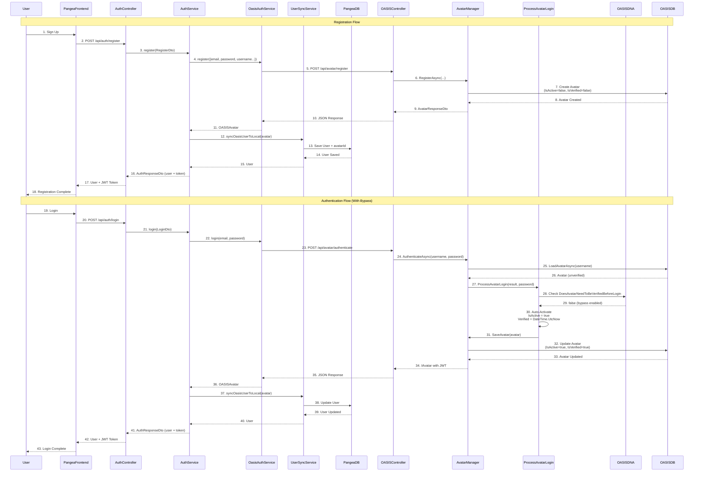
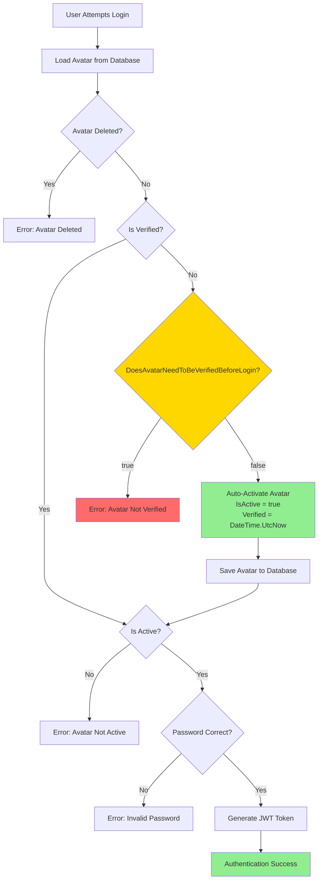
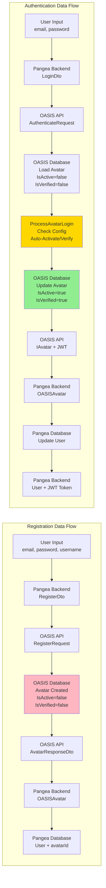
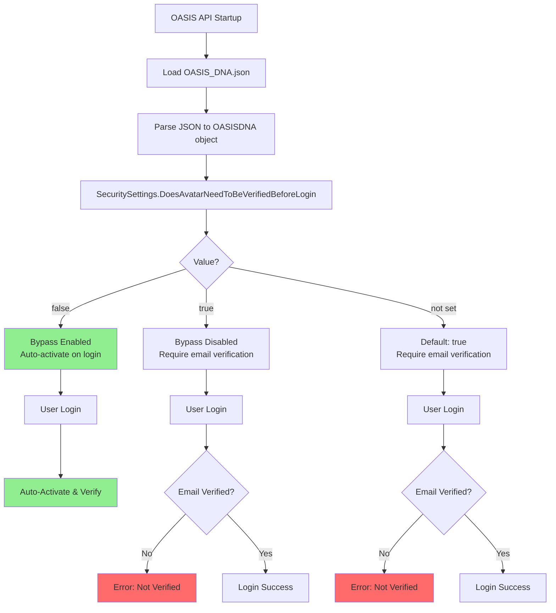

# Email Verification Bypass - Architecture Diagram

## System Architecture Flow

```mermaid
graph TB
    subgraph "Pangea Frontend"
        FE[User Interface]
    end
    
    subgraph "Pangea Backend"
        AC[AuthController<br/>POST /api/auth/register<br/>POST /api/auth/login]
        AS[AuthService<br/>auth.service.ts]
        OAS[OasisAuthService<br/>oasis-auth.service.ts]
        USS[UserSyncService<br/>user-sync.service.ts]
        DB[(Pangea Database<br/>users table)]
    end
    
    subgraph "OASIS API"
        OAC[AvatarController<br/>POST /api/avatar/register<br/>POST /api/avatar/authenticate]
        AM[AvatarManager<br/>AvatarManager.cs]
        PAL[ProcessAvatarLogin<br/>AvatarManager-Private.cs]
        DNA[OASISDNA<br/>OASIS_DNA.json]
        ODB[(OASIS Database<br/>MongoDB/Neo4j/etc)]
    end
    
    FE -->|1. User Registration| AC
    AC -->|2. register()| AS
    AS -->|3. register()| OAS
    OAS -->|4. POST /api/avatar/register| OAC
    OAC -->|5. Register()| AM
    AM -->|6. RegisterAsync()| ODB
    ODB -->|7. Avatar Created<br/>IsActive=false<br/>IsVerified=false| AM
    AM -->|8. AvatarResponseDto| OAC
    OAC -->|9. JSON Response| OAS
    OAS -->|10. OASISAvatar| AS
    AS -->|11. syncOasisUserToLocal()| USS
    USS -->|12. Save User<br/>Link avatarId| DB
    DB -->|13. User + avatarId| AS
    AS -->|14. Generate JWT| AC
    AC -->|15. User + Token| FE
    
    FE -->|16. User Login| AC
    AC -->|17. login()| AS
    AS -->|18. login()| OAS
    OAS -->|19. POST /api/avatar/authenticate| OAC
    OAC -->|20. Authenticate()| AM
    AM -->|21. LoadAvatarAsync()| ODB
    ODB -->|22. Avatar Data| AM
    AM -->|23. ProcessAvatarLogin()| PAL
    PAL -->|24. Check Config| DNA
    DNA -->|25. DoesAvatarNeedToBeVerifiedBeforeLogin=false| PAL
    PAL -->|26. Auto-Activate<br/>Auto-Verify<br/>IsActive=true<br/>IsVerified=true| AM
    AM -->|27. SaveAvatar()| ODB
    ODB -->|28. Updated Avatar| AM
    AM -->|29. IAvatar with JWT| OAC
    OAC -->|30. JSON Response| OAS
    OAS -->|31. OASISAvatar| AS
    AS -->|32. syncOasisUserToLocal()| USS
    USS -->|33. Update User| DB
    DB -->|34. User Data| AS
    AS -->|35. Generate JWT| AC
    AC -->|36. User + Token| FE
    
    style DNA fill:#90EE90
    style PAL fill:#FFD700
    style ODB fill:#87CEEB
    style DB fill:#87CEEB
```

## File Structure & Responsibilities

```mermaid
graph LR
    subgraph "Configuration"
        DNA_JSON[OASIS_DNA.json<br/>ONODE/NextGenSoftware.OASIS.API.ONODE.WebAPI/<br/><br/>DoesAvatarNeedToBeVerifiedBeforeLogin: false]
        DNA_CS[OASISDNA.cs<br/>OASIS Architecture/NextGenSoftware.OASIS.API.DNA/<br/><br/>SecuritySettings class]
    end
    
    subgraph "OASIS API - Controllers"
        AC_CTRL[AvatarController.cs<br/>ONODE/NextGenSoftware.OASIS.API.ONODE.WebAPI/Controllers/<br/><br/>Register endpoint<br/>Authenticate endpoint]
    end
    
    subgraph "OASIS API - Core Logic"
        AM_MAIN[AvatarManager.cs<br/>OASIS Architecture/NextGenSoftware.OASIS.API.Core/Managers/<br/><br/>RegisterAsync<br/>AuthenticateAsync]
        AM_PRIVATE[AvatarManager-Private.cs<br/>OASIS Architecture/NextGenSoftware.OASIS.API.Core/Managers/<br/><br/>ProcessAvatarLogin<br/>Auto-activation logic]
        DTO[AvatarResponseDto.cs<br/>ONODE/NextGenSoftware.OASIS.API.ONODE.WebAPI/Models/Avatar/<br/><br/>Response DTO]
    end
    
    subgraph "Pangea Backend - Services"
        AUTH_SVC[auth.service.ts<br/>pangea-repo/src/auth/services/<br/><br/>Main auth orchestration]
        OASIS_SVC[oasis-auth.service.ts<br/>pangea-repo/src/auth/services/<br/><br/>OASIS API client]
        USER_SYNC[user-sync.service.ts<br/>pangea-repo/src/auth/services/<br/><br/>User synchronization]
    end
    
    subgraph "Pangea Backend - Controllers"
        AUTH_CTRL[auth.controller.ts<br/>pangea-repo/src/auth/<br/><br/>HTTP endpoints]
    end
    
    subgraph "Pangea Backend - Database"
        USER_ENTITY[user.entity.ts<br/>pangea-repo/src/users/entities/<br/><br/>User model with avatarId]
    end
    
    DNA_JSON --> DNA_CS
    DNA_CS --> AM_PRIVATE
    AC_CTRL --> AM_MAIN
    AM_MAIN --> AM_PRIVATE
    AM_PRIVATE --> DTO
    DTO --> AC_CTRL
    AC_CTRL --> OASIS_SVC
    OASIS_SVC --> AUTH_SVC
    AUTH_SVC --> USER_SYNC
    USER_SYNC --> USER_ENTITY
    AUTH_CTRL --> AUTH_SVC
    
    style DNA_JSON fill:#90EE90
    style AM_PRIVATE fill:#FFD700
    style OASIS_SVC fill:#FFA500
    style AUTH_SVC fill:#FFA500
```



## Detailed Flow Sequence



## Key Decision Points



## File Locations Reference

### OASIS API Files

| File | Path | Purpose |
|------|------|---------|
| **OASIS_DNA.json** | `ONODE/NextGenSoftware.OASIS.API.ONODE.WebAPI/OASIS_DNA.json` | Configuration file - sets `DoesAvatarNeedToBeVerifiedBeforeLogin: false` |
| **OASISDNA.cs** | `OASIS Architecture/NextGenSoftware.OASIS.API.DNA/OASISDNA.cs` | Configuration class - defines `SecuritySettings.DoesAvatarNeedToBeVerifiedBeforeLogin` |
| **AvatarController.cs** | `ONODE/NextGenSoftware.OASIS.API.ONODE.WebAPI/Controllers/AvatarController.cs` | HTTP endpoints for registration and authentication |
| **AvatarManager.cs** | `OASIS Architecture/NextGenSoftware.OASIS.API.Core/Managers/AvatarManager/AvatarManager.cs` | Main avatar management - calls `ProcessAvatarLogin` |
| **AvatarManager-Private.cs** | `OASIS Architecture/NextGenSoftware.OASIS.API.Core/Managers/AvatarManager/AvatarManager-Private.cs` | **Contains bypass logic** - `ProcessAvatarLogin()` method (lines 1127-1141) |
| **AvatarResponseDto.cs** | `ONODE/NextGenSoftware.OASIS.API.ONODE.WebAPI/Models/Avatar/AvatarResponseDto.cs` | Response DTO to prevent circular references |

### Pangea Backend Files

| File | Path | Purpose |
|------|------|---------|
| **auth.controller.ts** | `pangea-repo/src/auth/auth.controller.ts` | HTTP endpoints for registration/login |
| **auth.service.ts** | `pangea-repo/src/auth/services/auth.service.ts` | Main authentication orchestration |
| **oasis-auth.service.ts** | `pangea-repo/src/auth/services/oasis-auth.service.ts` | OASIS API client - makes HTTP requests |
| **user-sync.service.ts** | `pangea-repo/src/auth/services/user-sync.service.ts` | Syncs OASIS avatars to Pangea database |
| **user.entity.ts** | `pangea-repo/src/users/entities/user.entity.ts` | User model with `avatarId` field |

## Data Flow



## Configuration Flow



## Summary

### Key Components

1. **Configuration Layer**
   - `OASIS_DNA.json` - Runtime configuration
   - `OASISDNA.cs` - Configuration class definition

2. **API Layer**
   - `AvatarController.cs` - HTTP endpoints
   - `AvatarResponseDto.cs` - Response format

3. **Business Logic Layer**
   - `AvatarManager.cs` - Main orchestration
   - `AvatarManager-Private.cs` - **Bypass logic implementation**

4. **Integration Layer (Pangea)**
   - `oasis-auth.service.ts` - OASIS API client
   - `auth.service.ts` - Authentication orchestration
   - `user-sync.service.ts` - User synchronization

5. **Data Layer**
   - OASIS Database - Avatar storage
   - Pangea Database - User storage with `avatarId` link

### Critical Path

The bypass logic is executed in:
- **File**: `AvatarManager-Private.cs`
- **Method**: `ProcessAvatarLogin()` (lines 1127-1141)
- **Condition**: `OASISDNA?.OASIS?.Security?.DoesAvatarNeedToBeVerifiedBeforeLogin == false`
- **Action**: Auto-activate and auto-verify avatar on first login

---

**Last Updated:** 2025-01-02  
**Diagram Format:** Mermaid (compatible with GitHub, GitLab, and most markdown viewers)


