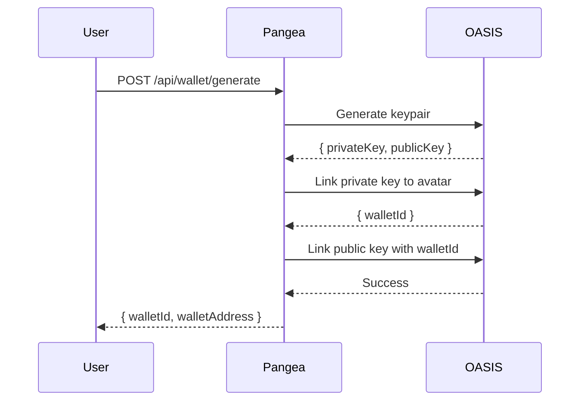

# OASIS Wallet Integration

Complete guide for wallet generation and management using the OASIS Keys API.

---

## Overview

Pangea uses the OASIS Web4 platform for wallet infrastructure, providing:
- Multi-chain support (Solana, Ethereum)
- Key management via Keys API
- Wallet linking to Avatars (OASIS user identities)
- Balance tracking and synchronization

### Why OASIS?

| Aspect          | OASIS                        | Alternative (Privy.io) |
| --------------- | ---------------------------- | ---------------------- |
| **Integration** | Already integrated with auth | New service to add     |
| **Cost**        | No additional cost           | Per-user pricing       |
| **Control**     | Full control                 | Vendor managed         |
| **Multi-chain** | Solana, Ethereum, more       | Similar support        |
| **Maintenance** | Self-maintained              | Managed service        |

---

## Architecture

```
User Request → Pangea Backend → OASIS API
                    ↓
             Token Manager ←→ Redis (token cache)
                    ↓
              Wallet Service → Keys API
                    ↓
              Response to User
```

### Key Components

| Component         | File                                          | Purpose                    |
| ----------------- | --------------------------------------------- | -------------------------- |
| Token Manager     | `src/services/oasis-token-manager.service.ts` | Auth token caching/refresh |
| Wallet Service    | `src/services/oasis-wallet.service.ts`        | Wallet operations          |
| Wallet Controller | `src/wallet/wallet.controller.ts`             | API endpoints              |

---

## Wallet Generation Flow

### Step-by-Step Process



### API Calls

1. **Generate Keypair**
   ```http
   POST /api/keys/generate_keypair_for_provider/{providerType}
   Authorization: Bearer <oasis-token>
   ```

2. **Link Private Key** (creates wallet)
   ```http
   POST /api/keys/link_provider_private_key_to_avatar_by_id
   Body: {
     "AvatarID": "<avatarId>",
     "ProviderType": "SolanaOASIS",
     "ProviderKey": "<privateKey>"
   }
   ```

3. **Link Public Key**
   ```http
   POST /api/keys/link_provider_public_key_to_avatar_by_id
   Body: {
     "WalletId": "<walletId>",
     "AvatarID": "<avatarId>",
     "ProviderType": "SolanaOASIS",
     "ProviderKey": "<publicKey>",
     "WalletAddress": "<walletAddress>"
   }
   ```

---

## Provider Types

| Provider        | Use Case         | Network        |
| --------------- | ---------------- | -------------- |
| `SolanaOASIS`   | Solana wallets   | Mainnet/Devnet |
| `EthereumOASIS` | Ethereum wallets | Mainnet/Goerli |

---

## Token Management

### Token Extraction

The OASIS API returns tokens in a nested structure:

```typescript
// Response structure from /api/avatar/authenticate
{
  result: {
    result: {
      jwtToken: "eyJ..."
    }
  }
}
```

Token extraction checks multiple paths for compatibility:
```typescript
const token =
  data?.result?.result?.jwtToken ||   // Most common
  data?.result?.Result?.jwtToken ||   // Alternate casing
  data?.result?.jwtToken ||           // Direct result
  data?.jwtToken ||                   // Direct data
  data?.token;                        // Fallback
```

### Token Caching

Tokens are cached in Redis to avoid repeated authentication:

```typescript
// Cache key format
`oasis:token:${avatarId}`

// TTL: 1 hour (token expires in 24 hours)
```

### Token Injection

Tokens are automatically injected into OASIS API requests via axios interceptor:

```typescript
axiosClient.interceptors.request.use(async (config) => {
  const token = await tokenManager.getToken();
  if (token) {
    config.headers['Authorization'] = `Bearer ${token}`;
  }
  return config;
});
```

---

## API Endpoints

### Generate Wallet

```http
POST /api/wallet/generate
Authorization: Bearer <pangea-jwt>

{
  "providerType": "SolanaOASIS",
  "setAsDefault": true
}
```

**Response:**
```json
{
  "success": true,
  "message": "Wallet generated successfully for SolanaOASIS",
  "wallet": {
    "walletId": "uuid",
    "walletAddress": "82WWF6YbXZGdetU9Gfv32RhhMaMn8CQZ2Rtx889xgpB7",
    "providerType": "SolanaOASIS",
    "isDefaultWallet": true,
    "balance": 0
  }
}
```

### Get Balances

```http
GET /api/wallet/balance
Authorization: Bearer <pangea-jwt>
```

**Response:**
```json
{
  "success": true,
  "balances": [
    {
      "walletId": "uuid",
      "walletAddress": "82WWF6...",
      "providerType": "SolanaOASIS",
      "balance": "0",
      "tokenSymbol": "SOL"
    }
  ]
}
```

### Connect External Wallet

```http
# 1. Get verification message
GET /api/wallet/verification-message?walletAddress=xxx&blockchain=solana

# 2. Sign message with wallet (Phantom/MetaMask)

# 3. Submit signature
POST /api/wallet/connect
{
  "walletAddress": "xxx",
  "signature": "xxx",
  "message": "xxx",
  "blockchain": "solana"
}
```

---

## Error Handling

### Common Errors

| Error                  | Cause              | Solution            |
| ---------------------- | ------------------ | ------------------- |
| 405 Method Not Allowed | Token not injected | Check token manager |
| 401 Unauthorized       | Token expired      | Refresh token       |
| 500 Keypair Generation | OASIS API issue    | Check OASIS status  |

### 405 Error Debugging

A 405 error typically indicates authentication failure:

```typescript
if (statusCode === 405) {
  throw new HttpException(
    `Method not allowed (405) - Check OASIS API token is valid`,
    HttpStatus.INTERNAL_SERVER_ERROR,
  );
}
```

**Debugging steps:**
1. Check Railway logs for token extraction
2. Verify token is being cached in Redis
3. Confirm token is injected into requests
4. Test direct OASIS API call

---

## Testing

### Manual Test Script

```bash
# Get Pangea auth token
TOKEN=$(curl -s -X POST "https://pangea-production-128d.up.railway.app/api/auth/login" \
  -H "Content-Type: application/json" \
  -d '{"email":"user@example.com","password":"password"}' | jq -r '.token')

# Generate Solana wallet
curl -X POST "https://pangea-production-128d.up.railway.app/api/wallet/generate" \
  -H "Content-Type: application/json" \
  -H "Authorization: Bearer $TOKEN" \
  -d '{"providerType":"SolanaOASIS","setAsDefault":true}' | jq '.'

# Generate Ethereum wallet
curl -X POST "https://pangea-production-128d.up.railway.app/api/wallet/generate" \
  -H "Content-Type: application/json" \
  -H "Authorization: Bearer $TOKEN" \
  -d '{"providerType":"EthereumOASIS","setAsDefault":false}' | jq '.'

# Check balances
curl -X GET "https://pangea-production-128d.up.railway.app/api/wallet/balance" \
  -H "Authorization: Bearer $TOKEN" | jq '.'
```

### Test Checklist

| Test                     | Expected Result   |
| ------------------------ | ----------------- |
| Generate Solana wallet   | 201 with walletId |
| Generate Ethereum wallet | 201 with walletId |
| Get balances             | List of wallets   |
| Invalid provider         | 400 error         |
| Missing auth             | 401 error         |

---

## Debugging

### Enable Debug Logs

Check Railway logs for:
- `Token extracted successfully. Length: X`
- `Token injected into request: POST /api/keys/...`
- `Keypair generated: { publicKey: ... }`
- `Wallet created with ID: ...`

### Log Patterns

```
[SUCCESS] Token extraction:
✅ OASIS API token refreshed successfully
Token length: 1234, prefix: eyJhbGciOiJ...

[SUCCESS] Wallet generation:
Step 1: Keypair generation - 200 OK
Step 2: Private key linking - walletId received
Step 3: Public key linking - complete
Step 4: Set as default - done

[FAILURE] Token issues:
⚠️ No token available for OASIS API request
❌ 405 Method Not Allowed - authentication failure
```

---

## Environment Variables

```env
# OASIS API
OASIS_API_URL=https://api.oasisweb4.com
OASIS_API_KEY=your-oasis-api-key

# OASIS Admin (for service-level operations)
OASIS_ADMIN_EMAIL=admin@example.com
OASIS_ADMIN_PASSWORD=secure-password

# Redis (for token caching)
REDIS_URL=redis://localhost:6379
```

---

## Module Documentation

For implementation details, see:
- [`backend/src/wallet/README.md`](../backend/src/wallet/README.md) - Wallet module internals
- [`backend/src/auth/README.md`](../backend/src/auth/README.md) - Authentication with OASIS

